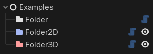
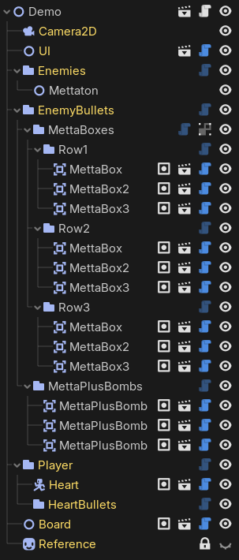

#  Godot Folder Nodes

A Godot addon that adds dedicated folder nodes for organizing your scene trees!

Folder nodes behave exactly like the built-in classes they extend (`Node`, `Node2D`, and `Node3D`) but use custom editor icons to visually distinguish organizational nodes from other objects.

<i>(... plus, as a developer, they are much more aesthetically pleasing to look at.)</i>

## Screenshots
Folder nodes can be used anywhere you would normally use empty `Node`, `Node2D`, or `Node2D` instanes for organization.
<table>
  <td valign="top"></td>
  <td valign="top"></td>
</table>

## Installation
1. Download or clone this repository.
2. Move the `folder_nodes/` folder inside your project's `addons/` directory.
3. Enable the addon in your Project Settings' Plugins tab.
4. Click the <b>+</b> button in the Scene dock to start creating folder nodes!
